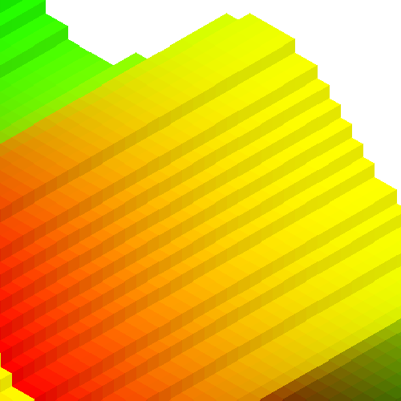

# Hacky Isometric

## Credits

* [Computer Graphics: Scan Line Polygon Fill Algorithm](https://hackernoon.com/computer-graphics-scan-line-polygon-fill-algorithm-3cb47283df6)
  for the excellent explanation of the polygon fill algorithm
